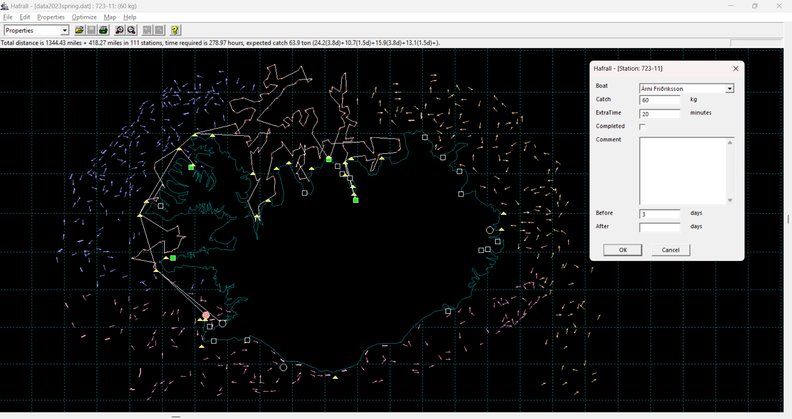

# HafrallX64

### Downloading the Hafrall Program

You can download the Win64 version of the program, `Hafrall`, directly from the GitHub repository:

- **Location**: [bin/Hafrall3.exe](https://github.com/tprunarsson/HafrallX64/blob/main/bin/Hafrall3.exe) *(replace with actual link)*

The program is fully standalone and does not require any additional files to run.

**Important**: Some browsers or antivirus software may flag `.exe` files as potentially unsafe for download. This is a common precaution due to the nature of executable files. However, rest assured that `Hafrall3.exe` is safe to use.

To proceed with the download:
- You may need to allow the download manually if your browser blocks it.
- After downloading, simply run the `.exe` file to start using the program.

The data/ includes the 2023 Spring Survey.

